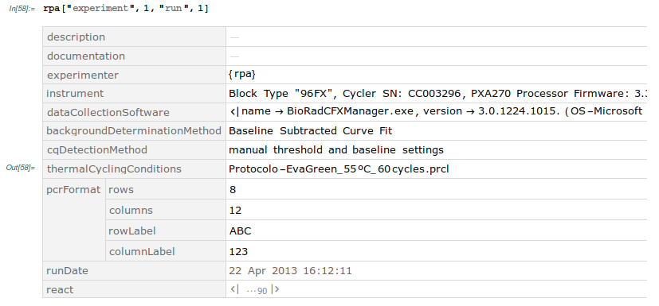
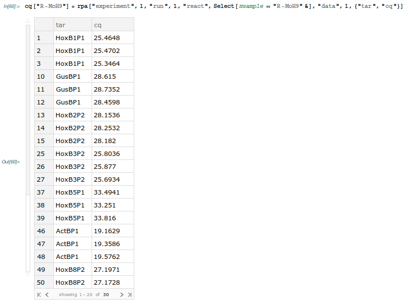

# rdml: Mathematica package for Real-Time qPCR data

## Overview

The *rdml* importer is an open source [Wolfram](https://en.wikipedia.org/wiki/Wolfram_Language) package that allows the validation and import of the standard  [RDML](http://rdml.org) files generated by most of the widely used qPCR equipments. 

This package makes qPCR data, and all of its experimental settings, readily available to [Mathematica](https://en.wikipedia.org/wiki/Wolfram_Mathematica) users without the additional burden of becoming familiarized with the RDML schema and having to learn new package-specific functions.

The files from this repository you will need to have a working package are:

1. Package: `rdml.m`;
2. XML schema: `RDML_v1_2_REC.xsd`, from [RDML schema version 1.2](http://rdml.org/RDML_v1_2_REC.xsd).

Example dataset files that accompany this package can be found in the folder *./datasets*:

1. `1507AA03.rdml`, downloaded from the [RDML Consortium database](http://rdmldb.org/);
2. `QPCRCourseApril2015_plate_1_.rdml`, from [Ruijter et al., 2015](http://dx.doi.org/10.1016/j.bdq.2015.07.001) but downloaded from [HFRC, AMC, the Netherlands](http://www.hartfaalcentrum.nl/index.php?main=files&sub=0);
3. `rdml_data.xml`, resultant file from unzipping `QPCRCourseApril2015_plate_1_.rdml`;
4. `rpa.rdml`, courtesy of [Raquel P. Andrade Lab, CBMR, Portugal](http://cbmr.ualg.pt/research/stemcelldevelop/temporal-control-laboratory/).


## Basic usage


### Loading the package

Make sure that `rdml.m` is in your current working directory, and that `RDML_v1_2_REC.xsd` also resides in the same directory. Then, to load the package, simply run:

``` 
Get["rdml.m"]
```

### Importing RDML data

Now, the builtin `Import` function should be overloaded to work with `.rdml` and `.rdm` files.

Try importing one of the example data files (found in the *datasets* folder). For example `rpa.rdml`:

``` 
rdml_data = Import["datasets/rpa.rdml"]
```


The data becomes then available as a `Dataset` object, on which all the recently expanded query functionalities of Mathematica can be be applied. For more information on how to take advantage of the new data query language check [Computation with Structured Datasets](http://reference.wolfram.com/language/guide/ComputationWithStructuredDatasets.html). 

## RDML Schema version

The package is fully compatible with RDML version 1.2, and partially backwards compatible with versions 1.0 and 1.1.

## RDML-related Import options

| Option             | Default value | Description                                                   |
|--------------------|---------------|---------------------------------------------------------------|
| ValidateAgainstXSD | False         | whether to validate file against RDML schema before importing |
| Compressed         | Automatic     | whether to assume that the file is a compressed archive       |
| Dataset            | True          | whether to return a Dataset structure expression              |

### ValidateAgainstXSD option

The RDML Consortium defined a XML Schema (XSD) for the RDML standard. The importer presented here fully supports currently the most recent version 1.2 (`RDML_v1_2_REC.xsd`). By default, the importer will not attempt to validate the file against the XML schema. If the file to be imported is not compliant with version 1.2, it will still attempt to import inasmuch as it is compatible with version 1.2.

However, to check if the file to be imported complies with the XML Schema, set the option `"ValidateAgainstXSD"->True`. If the file fails to be validated, a warning is issued and `Import` returns `$Failed`.

```
Import["datasets/QPCRCourseApril2015_plate_1_.rdml",  "ValidateAgainstXSD" -> True]
```


Conversely, if no errors are detected, the data is simply returned:

```
Import["datasets/rpa.rdml", "ValidateAgainstXSD" -> True]
```


Frequently, RDML files do not fully comply with the XML Schema yet the errors are relatively minor. The importer will try to import as much as it can given the Schema, being flexible where it can.

```
Import["datasets/QPCRCourseApril2015_plate_1_.rdml",  "ValidateAgainstXSD" -> False]
```


### Compressed option

According to the RDML Consortium guidelines, the XML file containing the RDML compliant data should be stored in a file named `rdml_data.xml`. This file should be compressed into a *pkzip* compatible archive. The archive can be freely named, however instead of holding the *.zip* extension, it should hold the *.rdml* (preferably) or *.rdm* extension. In addition, RDML compatible software should be able to read compressed *.rdml* or *.rdm* files, as well as uncompressed *.xml* files.

By default the importer tries to determine if the file is compressed or not (default option `"Compressed"->Automatic`) by checking if the first two bytes of the file correspond to the ASCII string `"PK"`.

For instance, if you'd want to manually check if some file is a *pkzip* compatible archive, you could run:

```
Import["datasets/QPCRCourseApril2015_plate_1_.rdml", {"Byte", {1, 2}}] // FromCharacterCode
```

that should return `PK`.

By default, the importer will automatically determine the file compression status and import accordingly.

The following three `Import` calls are all equivalent for a compressed RDML file:

```
Import["datasets/QPCRCourseApril2015_plate_1_.rdml"]
Import["datasets/QPCRCourseApril2015_plate_1_.rdml", "Compressed" -> Automatic]
Import["datasets/QPCRCourseApril2015_plate_1_.rdml", "Compressed" -> True]
```


Explicitly forcing the importer to assume that the file is not compressed (when it actually is) will result in `$Failed` with XML-related parsing errors:


The importer will run smoothly on an uncompressed file (`rdml_data.xml` is `QPCRCourseApril2015_plate _ 1_. rdml` uncompressed).

```
(* All equivalent *)
Import["datasets/rdml_data.xml", "RDML", "Compressed" -> False]
Import["datasets/rdml_data.xml", "RDML", "Compressed" -> Automatic]
Import["datasets/rdml_data.xml", "RDML"]
```


If the file extension is not *.rdml* or *.rdm*, then the file type is mandatory, otherwise `Import` will read the input file as XML and return a `XMLObject` expression:

```
Import["datasets/rdml_data.xml"]
```


### Dataset option

By default, the expression returned after import is a `Dataset` expression. Setting `"Dataset"-> False` returns the underlying RDML data explicitly as a nested structure of associations and lists.


## RDML structure quick overview

Lets import some RDML data first:

``` 
rpa = Import["datasets/rpa.rdml"]
```

To check top elements in the hierarchy:

```
Keys[rpa] // Normal
```


### version

The `version` element indicates the RDML Schema version of the file. This element can be easily retrieved from the `Dataset` object:

```
rpa["version"]
```
or directly extracted when importing:

```
Import["datasets/rpa.rdml", {"RDML", "version"}]
```

Since its release, the RDML standard has been revised twice: versions 1.1 and 1.2. Although this importer has been designed to fully support version 1.2, in practice, since version 1.2 Schema specification significantly overlaps with previous versions, this package can import RDML files from those previous versions (to the extent that they overlap with version 1.2).

Importing files from versions other than 1.2 results in a warning, yet most data is often successfully imported.


## dateMade and dateUpdated

The element `dateMade` indicates the date and time stamp of the creation of the file. The element `dateUpdated` indicates the date and time stamp of the last update of the file.

```
rpa["dateMade"]
rpa["dateUpdated"]
```

## id

Use the `id` element to show all ids. Each id can be used to assign a publisher and a serial number to the RDML file. Additionally, an MD5Hash can also be included.

```
rpa["id"]
```

## experimenter
The `experimenter` element contains a list of researchers and their info (in this case only one):

```
rpa["experimenter"]
```


Internally this is represented as an `Association`. The key in this `Association` corresponds to the XML id attribute from the original RDML file, which can be used by other elements to link here:


To retrieve all information related to one particular experimenter, one can either use the key (XML id) or simply pick out the corresponding part:


## documentation

The documentation element constitutes the multi-purpose documentation system from the RDML file. This element is a text field with an unique id (translated to a key in an `Association`). 

From many places in the RDML file, a reference can be made to these documentation elements, making it versatile and allowing the free annotation of the elements.

To retrieve all `documentation` elements:

```
rpa["documentation"]
```
In this file there is only one such element, whose contents pertain to the genome assembly version used to retrieve the genomic information on the HoxB gene cluster:

```
rpa["documentation", 1]
```

Whose text subelement contains: 

```
rpa["documentation", 1, "text"]
```

```
"The genomic information for the HoxB cluster is based on the Gallus gallus (chick) genome assembly version 2.1 (WASHUC2), as performed by the Genome Sequencing Center (http://genome.wustl.edu) at the Washington University School of Medicine, St. Louis."
```

## dye

The `dye` element contains information regarding the fluorescent chemical compounds used as dyes for the real-time monitoring of the qPCR reaction.

To show all dyes:


## sample

The sample element contains all samples used. It may describe standard samples used in a dilution series, but it will often describe different biological sources and/or conditions/treatments performed on biological material.

To inspect the different samples:

```
rpa["sample"]
```


Check information associated with one particular sample, e.g. `"R-MoH9"`:

```
rpa["sample", "R-MoH9"]
```


Each sample can have a type: *unkn* (unknown sample), *ntc* (non template control), *nac* (no amplification control), *std* (standard sample), *ntp* (no target present), *nrt* (minusRT, negative for Reverse Transcription), *pos* (positive control) or *opt* (optical calibrator sample).

```
rpa["sample", All, "type"]
```


Inspect the description of all samples:

```
rpa["sample", All, "description"]
```

## target

The `target` element contains all targets. A target is defined by the primer (and probe) mix added to the sample to specifically amplify the target sequence (amplicon).

```
rpa["target"]
```


Examine all amplicon sequences: 

```
rpa["target", All, "sequences", "amplicon", "sequence"]
```


Inspect the forward and reverse primers:

```
rpa["target", All, "sequences", {"forwardPrimer", "reversePrimer"},   "sequence"] // Dataset
```


The `xRef` subelement relates the targets to an external database: 

```
rpa["target", All, "xRef", 1]
```


## thermalCyclingConditions

The `thermalCyclingConditions` element describes the temperature and time steps taken by a thermocycler in order to amplify the DNA. It can be used to describe alternative cycling programs (e.g., a regular PCR or a cDNA synthesis program).

Show the temperature protocol description:

```
rpa["thermalCyclingConditions", 1, "description"]
```


Examine the various steps that compose the actual program:

```
rpa["thermalCyclingConditions", 1, "step"]

```


## experiment

The `experiment` element contains the data collected during one (or more) qPCR runs, where each run contains one or more qPCR reactions. Each reaction incorporates one sample (which is referred to by its id) and one or more data elements (one for each target (also referred by its id)). Multiple data elements are only required for a multiplex reaction, in which several targets are simultaneously measured (using different fluorescent dyes). If the reactions are measured in different runs, the data should be stored as separate runs.

Check the first `run` in the `experiment` element:

```
rpa["experiment", 1, "run", 1]
```


This run holds various details, including specifics about the hardware (instrument element) as well as details about the software that collected the data (`dataColletionSoftware`); `documentation`, `experimenter` and `thermalCyclingConditions` elements should have id references to elements previously defined. The `backgroundDeterminationMethod` and `cqDetectionMethod` elements include relevant information about the mathematical analysis of the qPCR amplification curves. The `pcrFormat` element allows downstream analysis software to display the data according to the qPCR instrument run format. Finally, the `react` element contains the actual data pertaining to the qPCR reactions, containing a list of qPCR reactions, each consisting of two subelements: `sample` and `data`.

```
rpa["experiment", 1, "run", 1, "react"]
```


Examine the summary of `cq` values for all reactions of sample `"R-MoH9"`:



The `adp` and `mdp` subelements contain the amplification and melting data, respectively. 

Plot amplification curves for all reactions of sample `"R-MoH9"`:

```
amplificationData["R-MoH9"] = rpa["experiment", 1, "run", 1, "react", 
   Select[#sample == "R-MoH9" &], "data", 1, "adp", All, {"cyc", "fluor"}];
```

```
ListPlot[amplificationData["R-MoH9"], Joined -> True, Frame -> True, PlotLabel -> "Amplification curves of R-MoH9 reactions", 
 FrameLabel -> {"Temperature (Celsius degrees)", 
   "Fluorescence (a.u)"}]
```


Plot melting curves for all reactions of sample `"R-MoH9"`:

```
meltingData["R-MoH9"] = rpa["experiment", 1, "run", 1, "react", Select[#sample == "R-MoH9" &], "data", 1, "mdp", All, {"tmp", "fluor"}];
```


To highlight the melting temperature, calculate the negative of the derivative of the fluorescence with respect to temperature:

```
meltingData2["R-MoH9"] = Values /@ meltingData["R-MoH9"] // Normal // Values;
```

```
interpolatedMeltingData["R-MoH9"] = Interpolation /@ meltingData2["R-MoH9"];
```

```
interpolatedDerMeltingData["R-MoH9"] = (-D[#[t], t]) & /@ interpolatedMeltingData["R-MoH9"];
```

```
Plot[interpolatedDerMeltingData["R-MoH9"], {t, 65, 95}, PlotRange -> All, Frame -> True, FrameLabel -> {"Temperature (Celsius degrees)", "-dfluor/dT"}]
```


### Keep calm and carry on  :)
